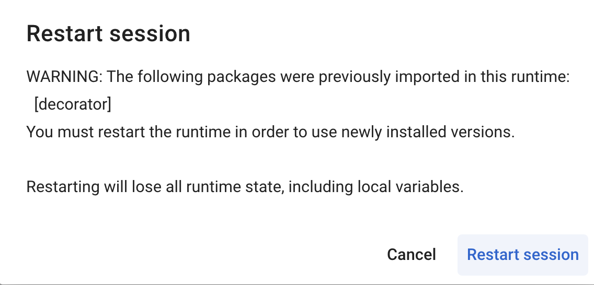

# CS5260 Assignment 6

## Environment

Google Colab

## Model used in the experiment

ResNet-18

## Dataset employed

CIFAR-10

## Parallel settings

nproc_per_node = 1

## Instructions on how to run your code

Run ass6.ipynb

### Notes:

While running the file for the very first time, Colab would need to restart the session:

Here we choose to restart the session and re-run from the first cell

## Experiment results

* lr_scheduler_80.pth
* model_80.pth
* optimizer_80.pth

/usr/local/lib/python3.10/dist-packages/colossalai/pipeline/schedule/_utils.py:19: UserWarning: torch.utils._pytree._register_pytree_node is deprecated. Please use torch.utils._pytree.register_pytree_node instead.
  _register_pytree_node(OrderedDict, _odict_flatten, _odict_unflatten)
/usr/local/lib/python3.10/dist-packages/torch/utils/_pytree.py:254: UserWarning: <class 'collections.OrderedDict'> is already registered as pytree node. Overwriting the previous registration.
  warnings.warn(
/usr/local/lib/python3.10/dist-packages/colossalai/shardformer/layer/normalization.py:45: UserWarning: Please install apex from source (https://github.com/NVIDIA/apex) to use the fused layernorm kernel
  warnings.warn("Please install apex from source (https://github.com/NVIDIA/apex) to use the fused layernorm kernel")
/usr/local/lib/python3.10/dist-packages/colossalai/initialize.py:48: UserWarning: `config` is deprecated and will be removed soon.
  warnings.warn("`config` is deprecated and will be removed soon.")
[04/12/24 09:26:17] INFO     colossalai - colossalai - INFO:
    /usr/local/lib/python3.10/dist-packages/colossalai/initialize.py:67
    launch
    INFO     colossalai - colossalai - INFO: Distributed environment is initialized,
                             world size: 1
Downloading https://www.cs.toronto.edu/~kriz/cifar-10-python.tar.gz to ./data/cifar-10-python.tar.gz
100%|██████████| 170498071/170498071 [00:06<00:00, 27918644.10it/s]
Extracting ./data/cifar-10-python.tar.gz to ./data
Files already downloaded and verified
/usr/local/lib/python3.10/dist-packages/colossalai/kernel/extensions/utils.py:96: UserWarning: [extension] The CUDA version on the system (12.2) does not match with the version (12.1) torch was compiled with. The mismatch is found in the minor version. As the APIs are compatible, we will allow compilation to proceed. If you encounter any issue when using the built kernel, please try to build it again with fully matched CUDA versions
  warnings.warn(
[extension] Compiling the JIT cpu_adam_x86 kernel during runtime now
[extension] Time taken to compile cpu_adam_x86 op: 37.307915449142456 seconds
/usr/local/lib/python3.10/dist-packages/colossalai/kernel/extensions/utils.py:96: UserWarning: [extension] The CUDA version on the system (12.2) does not match with the version (12.1) torch was compiled with. The mismatch is found in the minor version. As the APIs are compatible, we will allow compilation to proceed. If you encounter any issue when using the built kernel, please try to build it again with fully matched CUDA versions
  warnings.warn(
[extension] Compiling the JIT fused_optim_cuda kernel during runtime now
[extension] Time taken to compile fused_optim_cuda op: 245.48439502716064 seconds
/usr/local/lib/python3.10/dist-packages/colossalai/nn/optimizer/hybrid_adam.py:90: UserWarning: The torch.cuda.*DtypeTensor constructors are no longer recommended. It's best to use methods such as torch.tensor(data, dtype=*, device='cuda') to create tensors. (Triggered internally at ../torch/csrc/tensor/python_tensor.cpp:83.)
  self._dummy_overflow_buf = torch.cuda.IntTensor([0])
Epoch [1/80]:   0%|          | 0/500 [00:00<?, ?it/s]/usr/local/lib/python3.10/dist-packages/colossalai/nn/optimizer/nvme_optimizer.py:55: UserWarning: TypedStorage is deprecated. It will be removed in the future and UntypedStorage will be the only storage class. This should only matter to you if you are using storages directly.  To access UntypedStorage directly, use tensor.untyped_storage() instead of tensor.storage()
  numel += p.storage().size()
Epoch [1/80]: 100%|██████████| 500/500 [00:30<00:00, 16.32it/s, loss=1.39]

Epoch [2/80]: 100%|██████████| 500/500 [00:29<00:00, 17.11it/s, loss=1.18]
Epoch [3/80]: 100%|██████████| 500/500 [00:29<00:00, 16.85it/s, loss=0.995]
Epoch [4/80]: 100%|██████████| 500/500 [00:29<00:00, 17.09it/s, loss=0.955]
Epoch [5/80]: 100%|██████████| 500/500 [00:29<00:00, 17.06it/s, loss=0.861]
Epoch [6/80]: 100%|██████████| 500/500 [00:30<00:00, 16.55it/s, loss=0.75]
Epoch [7/80]: 100%|██████████| 500/500 [00:29<00:00, 16.96it/s, loss=0.752]
Epoch [8/80]: 100%|██████████| 500/500 [00:30<00:00, 16.59it/s, loss=0.714]
Epoch [9/80]: 100%|██████████| 500/500 [00:29<00:00, 16.97it/s, loss=0.785]
Epoch [10/80]: 100%|██████████| 500/500 [00:29<00:00, 16.84it/s, loss=0.721]
Epoch [11/80]: 100%|██████████| 500/500 [00:30<00:00, 16.65it/s, loss=0.703]
Epoch [12/80]: 100%|██████████| 500/500 [00:29<00:00, 16.93it/s, loss=0.684]
Epoch [13/80]: 100%|██████████| 500/500 [00:30<00:00, 16.49it/s, loss=0.582]
Epoch [14/80]: 100%|██████████| 500/500 [00:30<00:00, 16.51it/s, loss=0.61]
Epoch [15/80]: 100%|██████████| 500/500 [00:30<00:00, 16.46it/s, loss=0.633]
Epoch [16/80]: 100%|██████████| 500/500 [00:29<00:00, 16.70it/s, loss=0.431]
Epoch [17/80]: 100%|██████████| 500/500 [00:30<00:00, 16.50it/s, loss=0.47]
Epoch [18/80]: 100%|██████████| 500/500 [00:29<00:00, 16.94it/s, loss=0.523]
Epoch [19/80]: 100%|██████████| 500/500 [00:29<00:00, 16.90it/s, loss=0.495]
Epoch [20/80]: 100%|██████████| 500/500 [00:30<00:00, 16.60it/s, loss=0.5]
Epoch [21/80]: 100%|██████████| 500/500 [00:29<00:00, 16.84it/s, loss=0.42]
Epoch [22/80]: 100%|██████████| 500/500 [00:30<00:00, 16.61it/s, loss=0.353]
Epoch [23/80]: 100%|██████████| 500/500 [00:29<00:00, 16.86it/s, loss=0.403]
Epoch [24/80]: 100%|██████████| 500/500 [00:30<00:00, 16.60it/s, loss=0.329]
Epoch [25/80]: 100%|██████████| 500/500 [00:29<00:00, 16.68it/s, loss=0.333]
Epoch [26/80]: 100%|██████████| 500/500 [00:30<00:00, 16.62it/s, loss=0.358]
Epoch [27/80]: 100%|██████████| 500/500 [00:30<00:00, 16.65it/s, loss=0.352]
Epoch [28/80]: 100%|██████████| 500/500 [00:29<00:00, 16.86it/s, loss=0.231]
Epoch [29/80]: 100%|██████████| 500/500 [00:30<00:00, 16.43it/s, loss=0.202]
Epoch [30/80]: 100%|██████████| 500/500 [00:29<00:00, 16.76it/s, loss=0.253]
Epoch [31/80]: 100%|██████████| 500/500 [00:30<00:00, 16.43it/s, loss=0.256]
Epoch [32/80]: 100%|██████████| 500/500 [00:29<00:00, 16.78it/s, loss=0.305]
Epoch [33/80]: 100%|██████████| 500/500 [00:30<00:00, 16.42it/s, loss=0.186]
Epoch [34/80]: 100%|██████████| 500/500 [00:29<00:00, 16.75it/s, loss=0.304]
Epoch [35/80]: 100%|██████████| 500/500 [00:29<00:00, 16.68it/s, loss=0.223]
Epoch [36/80]: 100%|██████████| 500/500 [00:30<00:00, 16.48it/s, loss=0.256]
Epoch [37/80]: 100%|██████████| 500/500 [00:29<00:00, 16.69it/s, loss=0.224]
Epoch [38/80]: 100%|██████████| 500/500 [00:30<00:00, 16.40it/s, loss=0.234]
Epoch [39/80]: 100%|██████████| 500/500 [00:29<00:00, 16.77it/s, loss=0.222]
Epoch [40/80]: 100%|██████████| 500/500 [00:31<00:00, 15.94it/s, loss=0.215]
Epoch [41/80]: 100%|██████████| 500/500 [00:32<00:00, 15.56it/s, loss=0.174]
Epoch [42/80]: 100%|██████████| 500/500 [00:32<00:00, 15.32it/s, loss=0.19]
Epoch [43/80]: 100%|██████████| 500/500 [00:32<00:00, 15.25it/s, loss=0.122]
Epoch [44/80]: 100%|██████████| 500/500 [00:32<00:00, 15.57it/s, loss=0.163]
Epoch [45/80]: 100%|██████████| 500/500 [00:32<00:00, 15.28it/s, loss=0.118]
Epoch [46/80]: 100%|██████████| 500/500 [00:31<00:00, 15.69it/s, loss=0.263]
Epoch [47/80]: 100%|██████████| 500/500 [00:32<00:00, 15.36it/s, loss=0.134]
Epoch [48/80]: 100%|██████████| 500/500 [00:32<00:00, 15.23it/s, loss=0.15]
Epoch [49/80]: 100%|██████████| 500/500 [00:31<00:00, 15.65it/s, loss=0.0837]
Epoch [50/80]: 100%|██████████| 500/500 [00:32<00:00, 15.23it/s, loss=0.156]
Epoch [51/80]: 100%|██████████| 500/500 [00:32<00:00, 15.46it/s, loss=0.142]
Epoch [52/80]: 100%|██████████| 500/500 [00:33<00:00, 15.13it/s, loss=0.0749]
Epoch [53/80]: 100%|██████████| 500/500 [00:33<00:00, 15.11it/s, loss=0.0496]
Epoch [54/80]: 100%|██████████| 500/500 [00:32<00:00, 15.54it/s, loss=0.12]
Epoch [55/80]: 100%|██████████| 500/500 [00:32<00:00, 15.22it/s, loss=0.0753]
Epoch [56/80]: 100%|██████████| 500/500 [00:32<00:00, 15.36it/s, loss=0.0882]
Epoch [57/80]: 100%|██████████| 500/500 [00:32<00:00, 15.21it/s, loss=0.0388]
Epoch [58/80]: 100%|██████████| 500/500 [00:33<00:00, 15.12it/s, loss=0.0625]
Epoch [59/80]: 100%|██████████| 500/500 [00:32<00:00, 15.34it/s, loss=0.0885]
Epoch [60/80]: 100%|██████████| 500/500 [00:33<00:00, 15.03it/s, loss=0.164]
Epoch [61/80]: 100%|██████████| 500/500 [00:33<00:00, 15.15it/s, loss=0.0385]
Epoch [62/80]: 100%|██████████| 500/500 [00:32<00:00, 15.31it/s, loss=0.106]
Epoch [63/80]: 100%|██████████| 500/500 [00:33<00:00, 15.05it/s, loss=0.0686]
Epoch [64/80]: 100%|██████████| 500/500 [00:32<00:00, 15.24it/s, loss=0.0845]
Epoch [65/80]: 100%|██████████| 500/500 [00:33<00:00, 15.13it/s, loss=0.0405]
Epoch [66/80]: 100%|██████████| 500/500 [00:33<00:00, 15.01it/s, loss=0.0518]
Epoch [67/80]: 100%|██████████| 500/500 [00:32<00:00, 15.33it/s, loss=0.0854]
Epoch [68/80]: 100%|██████████| 500/500 [00:33<00:00, 15.01it/s, loss=0.0533]
Epoch [69/80]: 100%|██████████| 500/500 [00:33<00:00, 14.92it/s, loss=0.112]
Epoch [70/80]: 100%|██████████| 500/500 [00:32<00:00, 15.25it/s, loss=0.0839]
Epoch [71/80]: 100%|██████████| 500/500 [00:33<00:00, 14.79it/s, loss=0.0734]
Epoch [72/80]: 100%|██████████| 500/500 [00:33<00:00, 14.77it/s, loss=0.0708]
Epoch [73/80]: 100%|██████████| 500/500 [00:33<00:00, 14.82it/s, loss=0.0381]
Epoch [74/80]: 100%|██████████| 500/500 [00:33<00:00, 14.84it/s, loss=0.0484]
Epoch [75/80]: 100%|██████████| 500/500 [00:34<00:00, 14.70it/s, loss=0.107]
Epoch [76/80]: 100%|██████████| 500/500 [00:33<00:00, 14.93it/s, loss=0.0479]
Epoch [77/80]: 100%|██████████| 500/500 [00:33<00:00, 14.87it/s, loss=0.0619]
Epoch [78/80]: 100%|██████████| 500/500 [00:33<00:00, 14.76it/s, loss=0.0361]
Epoch [79/80]: 100%|██████████| 500/500 [00:33<00:00, 14.99it/s, loss=0.0446]
Epoch [80/80]: 100%|██████████| 500/500 [00:33<00:00, 14.96it/s, loss=0.0355]
Accuracy of the model on the test images: 84.68 %

====== Training on All Nodes =====
127.0.0.1: success

====== Stopping All Nodes =====
127.0.0.1: finish

| Model     | Dataset  | Booster       | Accuracy |
| --------- | -------- | ------------- | -------- |
| ResNet-18 | CIFAR-10 | DDP with FP32 | 84.68%   |
